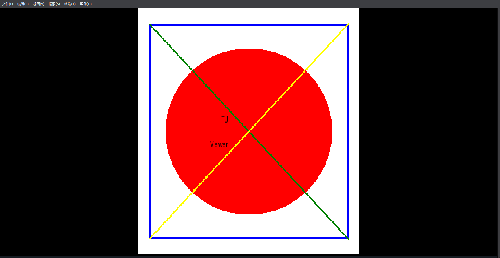

# go-tuimg

A terminal image viewer written in pure Go. Supports PNG, JPEG, GIF animation. Mouse drag, scroll wheel zoom, keyboard shortcuts.

纯 Go 实现的终端图片查看器，支持 PNG、JPEG、GIF 动画，支持鼠标拖动、滚轮缩放和键盘快捷键。

基于[term.everything](https://github.com/mmulet/term.everything)。



## 特性
- 纯Go实现，无C库依赖，静态编译，开箱即用
- 支持PNG、JPEG、GIF等常见图片格式
- 鼠标拖动移动图片
- 鼠标滚轮缩放
- 键盘快捷键操作

画面质量受限于终端的行数和列数。如果通过`Ctrl -`提高分辨率，画面质量会提高（但性能可能会下降），通过`Ctrl 0`恢复
## 安装
### 下载
从 [Releases](https://github.com/longxiucai/go-tuimg/releases) 页面下载对应平台的二进制文件。

### 编译
```bash
git clone https://github.com/longxiucai/go-tuimg.git
cd go-tuimg
go build -o go-tuimg .
```

## 使用

```bash
./go-tuimg image.png
./go-tuimg animation.gif
```

## 快捷键

| 按键 | 功能 |
|------|------|
| `+` / `=` | 放大 |
| `-` | 缩小 |
| `0` | 重置缩放和位置 |
| `方向键` / `hjkl` | 移动图片 |
| `Q` | 退出 |

## 鼠标操作

| 操作 | 功能 |
|------|------|
| 左键拖动 | 移动图片 |
| 滚轮上 | 放大 |
| 滚轮下 | 缩小 |

## 致谢
- [term.everything](https://github.com/mmulet/term.everything) - 输入解析代码参考